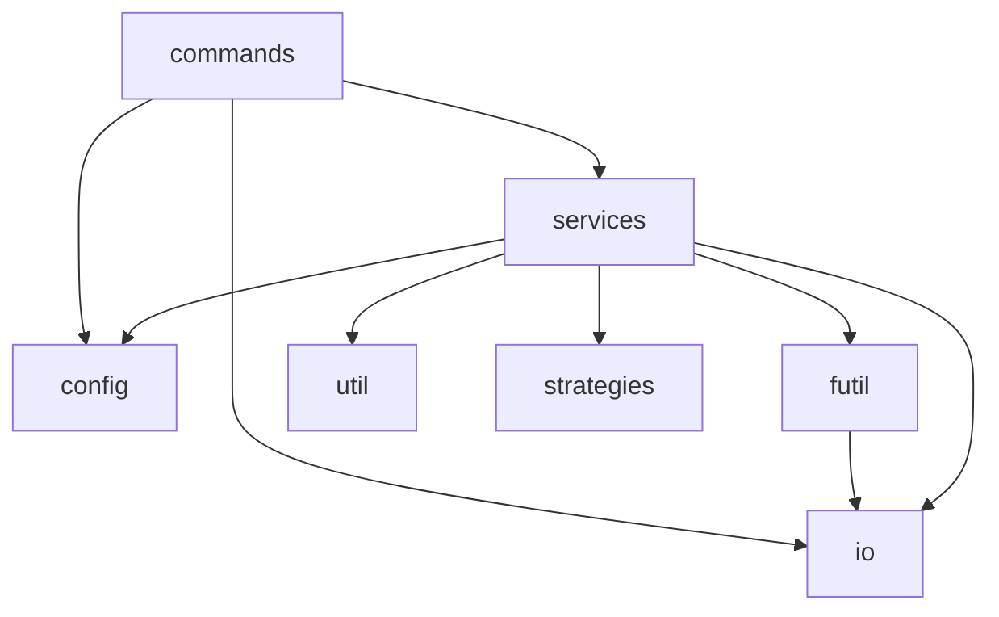

# Module Index Generator

<p align="right">
    <code>88.51% cov</code>&nbsp;
    <code>202 sloc</code>&nbsp;
    <code>25 files</code></p>

Generates barrel (index.js) files that rollup exports for each module in a directory and re-exports them as a single module.


[Star Fox 64 / Lylatwars](https://en.wikipedia.org/wiki/Star_Fox_64) released 1997 on Nintendo 64.

## Table of Contents

<!-- START doctoc generated TOC please keep comment here to allow auto update -->
<!-- DON'T EDIT THIS SECTION, INSTEAD RE-RUN doctoc TO UPDATE -->
<!-- END doctoc generated TOC please keep comment here to allow auto update -->

- [Install](#install)
- [Usage](#usage)
- [Example](#example)
- [Architecture](#architecture)

<!-- END doctoc generated TOC please keep comment here to allow auto update -->

## Install

```
npm install module-indexgen
```

Not to be confused with `indexgen` which is similar but deprecated.

## Usage

```
npx indexgen <targetDir> [<targetDir>...] [options]
```

Options:

`--type`: `cjs` or `esm`. Default is determined by `type` in `package.json`.

`--watch`: Regenerate on file changes.

## Example

Given the following directory structure:

```
proj/
    src/
        components/
            foo.js
            bar.js
```

Running `indexgen` from the `proj` directory produces:

```
proj/
    src/
        index.js
        components/
            bar.js
            foo.js
            foo-bar.js
            index.js
```

Contents of `proj/src/components/index.js`:

```js
module.exports = {
    bar: require('./bar'),
    foo: require('./foo'),    
    fooBar: require('./foo-bar')
}
```

Notice the key for `foo-bar` is camel cased to `fooBar`.

Contents of `proj/src/index.js`:

```js
module.exports = {
    components: require('./components')
}
```

`require('./src')` produces:

```
{
    components: {
        foo: (exported value for foo.js),
        bar: (exported value for bar.js),
        fooBar: (exported value for foo-bar.js)
    }
}
```

## Architecture

###### <p align="right"><em>Can't see the diagram?</em> <a id="link-1" href="https://github.com/mattriley/node-module-indexgen#user-content-link-1">View it on GitHub</a></p>

